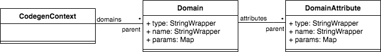
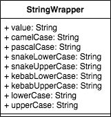

# Codegen 2.0

## About

Codegen 2.0 is a command line interface (CLI) for generating code based on fully customized user templates.
Through its own DSL (domain-specific language) the codegen generates the artifacts specified by the user in the modeling files and templates files.

Unlike other code generators on the market, codegen 2.0 templates do not present "polluted code", as it separates the source file from the generation logic.

Here is an example of a java class template using the velocity engine:

```groovy
package com.m2r.codegen;

class $domain.name {

#foreach( $attribute in $domain.attributes )
    private $attribute.type $attribute.name;
#end

#foreach( $attribute in $domain.attributes )
    public $attribute.type get${attribute.name.toPascalCase()}() {
        return $attribute.name;
    }

    public void set${attribute.name.toPascalCase()}($attribute.type id) {
        this.$attribute.name = $attribute.name;
    }

#end
}
```

Now see an example of the same template using codegen 2.0

```java
package com.m2r.codegen;

class Entity {

    private String name;
    
    public String getName() {
        return this.name;
    }
    
    public void setNam(String name) {
        this.name = name;
    }
}
```

As we can see, the template is much cleaner and this is only possible because codegen 2.0 separates the source file from the generation logic, through a definition file where the template is divided into generation blocks.
Thus, the code nature of the template is preserved, facilitating its maintenance.

Here's what the previous template definition file would look like

```groovy
template {
    sourceFile: 'entity.java'
    targetFile: 'src/main/java/com/m2r/example/entity/${domain.name}.java'
    consider: 'entity'
    block(3, 3) {
        replace('Entity', domain.name)
    }
    block(5, 5) {
        iterate(domain.attributes, item) {
            replace('String', item.type)
            replace('name', item.name)
        }
    }
    block(7, 9) {
        iterate(domain.attributes, item) {
            replace('String', item.type)
            replace('name', item.name)
            replace('Name', item.name.pascalCase)
        }
    }
    block(11, 13) {
        iterate(domain.attributes, item) {
            replace('String', item.type)
            replace('name', item.name)
            replace('Name', item.name.pascalCase)
        }
    }
}

```

## Installation

To install codegen 2.0, you need to download the `codegen.zip` file in the link below and follow the next steps (for each OS).

[](https://github.com/rdabotelho/codegen2/releases/tag/v2.0.0)

### macOS / Linux

1. Extract the gencode zip file into the home directory `~/`.
2. Give execution permission to the `codegen` file.
```shell
chmod +x ~/codegen/codegen
```
3. Add gencode directory to the OS path.
```shell
export PATH=$PATH:~/codegen
```
>**Note:** It is important to include this script in an initialization file to keep the directory in the path.
4. Run the following command `codegen -v`, if everything has been done correctly, you will see the following output:
```shell
Codegen command line interface (CLI)
Version: 2.0.0
```

### Windows

1. Extract the gencode zip file into the home directory `~/`.
2. Add gencode directory to the OS path (Environment variable -> User variables -> Path).
3. Run the following command `codegen -v`, if everything has been done correctly, you will see the following output:
```shell
Codegen command line interface (CLI)
Version: 2.0.0
```

## Usage

To use codegen, we need to initialize it from within your project, using the following command:

```bash
codegen init
```

If you prefer, we can clone the initial structure of a git repository, so we can reuse other templates already created.

```bash
codegen init https://github.com/rdabotelho/mytemplates.git
```

After initialized, we can see, inside your project, the following structure created.

```bash
- .codegen
  + modeling
  + templates
```
- **modeling:** Folder for models files (with own DSL).
- **templates:** Folder for the template files and definition files (with own DSL).

### Create a template
To create a template run the following command: `codegen create-template <FILE-NAME>`.

Example:
```bash
codegen create-template entity.java
```

See that two files were created in the folder `.codegen/templates`.
- **entity.df:** Template definition (with generation logic).
- **entity.java:** Template (without generation logic).

>**Note:** Both files are created with sample code that generates a class in Java. To ignore this example code, just erase and implement your own code.

### Create a modeling file

To be able to generate code, in addition to the template files, we need to create the domain model file.

To create a modeling file, run the following command: `codegen create-model <FILE-NAME>`.

Example:
```bash
codegen create-model entity.md
```

See that one file was created in the folder `.codegen/modeling`.
- **entity.md:** Modeling file (domain model).

```groovy
entity HelloWorld {
    String message
}
```

>**Note:** The modeling file is created with a sample code of a hello world entity. To ignore this example code, just erase and implement your own code.

### Code generation

Now, we can generate our code based on the template and modeling file created previously.

To do code generation, use the following command: `codegen generate <MODELING-FILE>`.

Example (if you haven't deleted the code generated in the previous examples):
```bash
codegen generate entity.md
```

See that one file was created in the folder `src/main/java/com/m2r/example/entity`.
- **HelloWorld.java:** Java class generated through the codegen.

```java
package com.m2r.example.entity;

public class HelloWorld {
    private String message;
    public String getMessage() {
        return this.message;
    }
    public void setMessage(String message) {
        this.message = message;
    }
}
```

### Codegen CLI commands

The following is a list of the commands available in the codegen CLI.

| Command             | Description                                             | Parameters                                                                       |
|---------------------|---------------------------------------------------------|----------------------------------------------------------------------------------|
| **init**            | Initialize a codegen project                            | - git url (optional)<br/>- git branch (optional)                                 |
| **create-template** | Create a new template file                              | - template file name                                                             |
| **create-model**    | Create a new modeling file                              | - model file name                                                                |
| **generate**        | Generate files based on templates                       | - model file name<br/>- force override (optional)                                |
| **shift**           | Shift blocks automatically in template definition files | - template definition file name<br/>- started line<br/>- total of lines to shift |

## Codegen 2.0 Engine

For the generation of the final file, gencode has an engine that implements two processes:
1. **Modelling file processing:** Receives the modeling file and transforms it into metadata with the user-defined model.
2. **Template definition file processing:** In addition to the metadata from the previous processing, it also receives the original template file and the file with the definition of how the template content will be generated.


## Modelling File

The modeling file is the artifact where the user models its domain, which will be the input for the modelling file processing.

### DSL of Modelling File

To implement the modelling file, the codegen provides its own domain-specific language (DSL) where the user structure its entities, enumeration and relationships, which will be used to make the template definition file.

### DSL Syntax

```bash
entity EntityName {
    String attribute1
    Integer attribute2 (param1: 'value')
    Boolean attribute3 (param1: 'value', param2: 'value')
    List<OtherEntity> attribute4 (param1: 'value', param2: 'value',...)
    :
}

entity OtherEntity (param1: 'value', param2: 'value',...) {
    String attribute1
    Date attribute2
    EnumName attribute3
    :
}

enum EnumName {
    ENUM_VALUE1
    ENUM_VALUE2
    ENUM_VALUE3
    :
}
```

### Modelling Metadata

The result of modelling file processing is the modelling metadata, that will be one of the entries of the template definition file processing.

This metadata is presented in the following diagram.



### StringWrapper Class

For all string values, codegen provides an helper class, called `StringWrapper`, that assist in the treatment of string values in the template definition file coding.



## Template Definition File

The template definition file is the artifact that guides the generation of the final file. It receives the modelling metadata, resulted of processing the modeling file processing, and replaces in the code blocks of original template file.


### DSL of Template Definition File

To create the template definition file, the codegen provides its own DSL where the user structure its blocks and functions to the target file generation.

### DSL Syntax

```bash
template {
    sourceFile: 'template-file-name'
    targetFile: 'target-file-name'
    consider: 'domain-type'
    block(start-line, end-line) {
        replace('old-value', new-value)
        showIf(object, method, param1, param2, ...)
        delimiter('prefix', 'divider', 'suffix')
        :
    }
    block(start-line, end-line) {
        iterate(list, item-name) {
            replace('old-value', new-value)
            replaceIf('old-value', new-value, object-method, param1, param2, ...)
            :
        }
    }
    :
}
```

### Generated file 

The result of template definition file processing, is the generated file expected.

Below, we present an example of a file generated from the example of the previous diagram.

```groovy
class User {
    id: number
    name: String
    login: String
    password: String
}
```

## Practical case

To present in a practical way the main benefits of gencode 2.0, let's create a microservice in Spring Boot and do all the model class generation, enumeration, repository and REST resource.

The purpose of our microservice is to expose a customer entity REST API and persist its data in an H2 database.

### Spring Initializer

To get started, go to site [Spring Initializer](https://start.spring.io/), and create a microservice project with the following characteristics:

- **Project:** Maven Project
- **Language:** Java
- **Spring Boot:** 2.7.2
- **Java Version:** 8 (tested)
- **Dependencies:**
  - Spring Web
  - Spring Data JPA
  - H2 Database

### Codegen initialization

After opening the project in an IDE of your preference and with the [codegen installed](##Installtion), run the startup command.

```bash
codegen init https://github.com/rdabotelho/codegen-templates.git
```

>**Note:** To speed up the process, we used the templates already created for this example in the repository `codegen-templates.git`. After initialization, feel free to make improvements.

After initialization, we can see the template files for `entity`, `enum`, `repository` and `resource`.

```bash
- .codegen
  + modeling
  - templates
      entity.df
      entity.java
      enum.df
      enum.java
      repository.df
      repository.java
      resource.df
      resource.java
```

### Creation of Customer entity

Create the modelling file `mode.md`

```bash
codegen create-model model.md
```

Replace the content of the generated file `.gencode/modeling/model.md` for the following content.

```bash
entity Customer {
    String name
    Gender gender
    LocalDate birthDate
    String address
    String city
    String state
}

enum Gender {
    MALE
    FEMALE
}
```

### Generation of microservice classes

Now let's generate our classes of `entity`, `enum`, `repository` and `resource`.

```bash
codegen generate model.md
```

As we can see, then gencode generated all the necessary classes for run our microservice.

```bash
- src
  - main
    - java
      - com
        - example
          - demo
            - model
              Customer.java
            - enums
              Gender.java
            - repository
              CustomerRepository.java
            - web
              - rest
                CustomerResource.java  
```

### Running the microservice

To test our microservice, just run the `DemoApplication.java` class.

```bash
curl --location --request POST 'http://localhost:8080/api/customers' \
--header 'Content-Type: application/json' \
--data-raw '{
	"name": "Raimundo Botelho",
	"gender": "MALE",
	"birthDate": "1979-08-07",
	"address": "San Francisco street",
	"city": "São paulo",
	"state": "SP"
}'
```

To test, open a terminal of your choice and call the add a new client endpoint.

```bash
curl --location --request GET 'http://localhost:8080/api/customers'
```

The result will be the customer persisted in the H2 database.

```bash
[
  {
    "id": 1,
	"name": "Raimundo Botelho",
	"gender": "MALE",
	"birthDate": "1979-08-07",
	"address": "San Francisco street",
	"city": "São paulo",
	"state": "SP"
  }
]
```

This is a small demonstration of what gencode can help in standardizing and accelerating your coding. Feel free to make changes to the code, test in another REST client tool and help us, collaborating with the improvement of the tool. Your feedback is very important!
