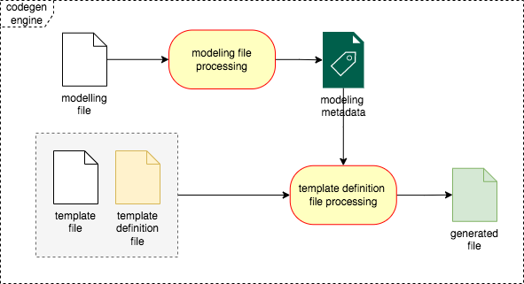
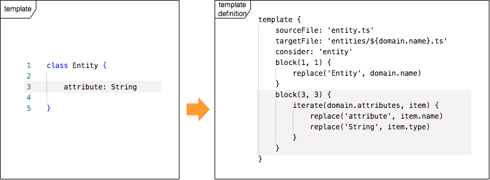

# Codegen 2.0

## **Table of contents**
### 1. [**About**](#about)
### 2. [**Installation**](#installation)
### 3. [**Usage**](#usage)
### 4. [**Codegen Engine**](#codegen-engine)
### 5. [**Practical Case**](#practical-case)

## About

Codegen 2.0 is a command line interface (CLI) for generating code based on fully customized user templates.
Through its own DSL (domain-specific language) the codegen generates the artifacts specified by the user in the modeling files and templates files.

Unlike other code generators on the market, codegen 2.0 templates do not present "polluted code", as it separates the source file from the generation logic.

Here is an example of a java class template using the velocity engine:

```groovy
package com.m2r.codegen;

class $domain.name {

#foreach( $attribute in $domain.attributes )
    private $attribute.type $attribute.name;
#end

#foreach( $attribute in $domain.attributes )
    public $attribute.type get${attribute.name.toPascalCase()}() {
        return $attribute.name;
    }

    public void set${attribute.name.toPascalCase()}($attribute.type id) {
        this.$attribute.name = $attribute.name;
    }

#end
}
```

Now see an example of the same template using codegen 2.0

```java
package com.m2r.codegen;

class Entity {

    private String name;
    
    public String getName() {
        return this.name;
    }
    
    public void setNam(String name) {
        this.name = name;
    }
}
```

As we can see, the template is much cleaner and this is only possible because codegen 2.0 separates the source file from the generation logic, through a definition file where the template is divided into generation blocks.
Thus, the code nature of the template is preserved, facilitating its maintenance.

Here's what the previous template definition file would look like

```groovy
template {
    sourceFile: 'entity.java'
    targetFile: 'src/main/java/com/m2r/example/entity/${domain.name}.java'
    scope: 'entity'
    block(3, 3) {
        replace('Entity', domain.name)
    }
    block(5, 5) {
        iterate(domain.attributes, item) {
            replace('String', item.type)
            replace('name', item.name)
        }
    }
    block(7, 9) {
        iterate(domain.attributes, item) {
            replace('String', item.type)
            replace('name', item.name)
            replace('Name', item.name.pascalCase)
        }
    }
    block(11, 13) {
        iterate(domain.attributes, item) {
            replace('String', item.type)
            replace('name', item.name)
            replace('Name', item.name.pascalCase)
        }
    }
}

```

## Installation

To install codegen 2.0, you need to download the `codegen.zip` file in the link below and follow the next steps (for each OS).

[](https://github.com/rdabotelho/codegen2/releases/tag/v2.1.4)

#### macOS / Linux

1. Extract the codegen zip file into the home directory `~/`.
2. Add codegen directory to the OS path.
```shell
export PATH=$PATH:~/codegen
```
>**Note:** It is important to include this script in an initialization file to keep the directory in the path.
3. Run the following command `codegen -v`, if everything has been done correctly, you will see the following output:
```shell
Codegen command line interface (CLI)
Version: 2.1.4
```

#### Windows

1. Extract the codegen zip file into the home directory `~/`.
2. Add codegen directory to the OS path (Environment variable -> User variables -> Path).
3. Run the following command `codegen -v`, if everything has been done correctly, you will see the following output:
```shell
Codegen command line interface (CLI)
Version: 2.1.4
```

## Usage

To use codegen 2.0, we need to initialize it from within your project, using the following command:

```bash
codegen init
```

If you prefer, we can clone the initial structure of a git repository, so we can reuse other templates already created.

```bash
codegen init https://github.com/rdabotelho/codegen-archetype.git master
```

After initialized, we can see, inside your project, the following structure created.

```bash
- .codegen
  + modeling
  + templates
    config.properties
```
- **modeling:** Folder for the models files (with own DSL).
- **templates:** Folder for the template files and definition files (with own DSL).
- **config.properties:** Properties file for the project's initial context.

### Creating a template
To create a template run the following command: `codegen create-template <FILE-NAME>`.

Example:
```bash
codegen create-template entity.java
```

See that two files were created in the folder `.codegen/templates`.
- **entity.df:** Template definition file (with generation logic).
- **entity.java:** Template file (without generation logic).

>**Note:** Both files are created with sample code that generates a class in Java. To ignore this example code, just erase and implement your own code.

### Creating a modeling file

To be able to generate code, in addition to the template files, we need to create the domain model file.

To create a modeling file, run the following command: `codegen create-model <FILE-NAME>`.

Example:
```bash
codegen create-model entity.mdsl
```

See that one file was created in the folder `.codegen/modeling`.
- **entity.md:** Modeling file (domain model).

```groovy
entity HelloWorld {
    String message
}
```

>**Note:** The modeling file is created with a sample code of a hello world entity. To ignore this example code, just erase and implement your own code.

### Code generation

Now, we can generate our code based on the template and modeling file created previously.

To do code generation, use the following command: `codegen generate <MODELING-FILE>`.

Example (if you haven't deleted the code generated in the previous examples):
```bash
codegen generate entity.mdsl
```

See that one file was created in the folder `src/main/java/com/m2r/example/entity`.
- **HelloWorld.java:** Java class generated through the codegen.

```java
package com.m2r.example.entity;

public class HelloWorld {
    private String message;
    public String getMessage() {
        return this.message;
    }
    public void setMessage(String message) {
        this.message = message;
    }
}
```

### Codegen CLI commands

The following is a list of the commands available in the codegen CLI.

| Command             | Description                                                        | Parameters                                                                       | Options                                                                   |
|---------------------|--------------------------------------------------------------------|----------------------------------------------------------------------------------|---------------------------------------------------------------------------|
| **init**            | Initialize a codegen project                                       | - git url (optional)<br/>- git branch (optional)                                 | **-p or --properties:** Properties file                                   |
| **create-template** | Create a new template file and template definition file            | - template file name                                                             |                                                                           |
| **create-model**    | Create a new modeling file                                         | - model file name                                                                |                                                                           |
| **shift**           | Shift blocks' lines automatically in the template definition files | - template definition file name<br/>- started line<br/>- total of lines to shift | **-r or --reverse:** Shift reverse                                        |
| **generate**        | Generate files based on templates                                  | - model file name                                                                | **-f or --force:** Force override<br/>**-t or --tag:** Tag for generation |

## Codegen Engine

For the generation of the final file, the codegen has an engine that implements two processes:
1. **Modeling file processing:** Receives the modeling file and transforms it into metadata with the user-defined modeling.
2. **Template definition file processing:** In addition to the metadata from the previous processing, it also receives the original template file and the file with the definition of how the template content will be generated.



### Modeling File

The modeling file is the artifact where the user models its domain, which will be the input for the modeling file processing.

To implement the modeling file, the codegen uses the lib Model DSL, where the user structure its entities, enumeration and relationships, which will be used to make the template definition file.

Learn more about [Model DSL](https://github.com/rdabotelho/model-dsl/blob/master/README.md)

#### Dynamic methods in StringWrapper Class

In addition to the native methods of the `StringWrapper` class (lib Model DSL), codegen implements some dynamic methods to facilitate string handling within the template definition file.

**To use on any attribute**

| Method Prefix   | Method Sufix Options                | Example          | 
|-----------------|-------------------------------------|------------------|
| **remove?**     | Space, Dot, Slash, Underscore, Dash | removeSpace      |
| **convert?To?** | Space, Dot, Slash, Underscore, Dash | convertDotToDash |

**To use in the methods: `showIf` and `replaceIf` (on template definition)**

| Method          | Parameter | Example                            | 
|-----------------|-----------|------------------------------------|
| **contains**    | Value     | domain.attributes.contains, 'enum' |
| **noContains**  | Value     | domain.attributes.contains, 'list' |
| **equals**      | Value     | domain.table.notEquals, 'enum'     |
| **notEquals**   | Value     | domain.table.notEquals, 'list'     |

### Template Definition File

The template definition file is the artifact that guides the generation of the final file. It receives the modeling metadata, resulted of processing the modeling file processing, and replaces in the code blocks of original template file.



#### DSL of Template Definition File

To create the template definition file, the codegen provides its own DSL where the user structure its blocks and functions to the target file generation.

#### DSL Syntax

```bash
template {
    sourceFile: 'template-file-name'
    targetFile: 'target-file-name'
    scope: 'singleton,entity,enum'
    tags: 'tag1,tag2,...' (optional)
    block(start-line, end-line) {
        replace('old-value', new-value)
        showIf(object, method, param1, param2, ...)
        :
    }
    block(start-line, end-line) {
        iterate(list, item-name) {
            showIf(object, method, param1, param2, ...)
            replace('old-value', new-value)
            replaceIf('old-value', new-value, object-method, param1, param2, ...) {
              mask('something: %s')
            }
            delimiter('prefix', 'divider', 'suffix')
            :
        }
    }
    :
}
```

**Attributes allowed in the template:**

| Command        | Description                                      |
|----------------|--------------------------------------------------|
| **sourceFile** | Template file name                               |
| **targetFile** | Target file name                                 |
| **scope**      | Scope para a geração (entity, enum or singleton) |

**Functions allowed in the blocks:**

| Command       | Description                                                  | Parameters                                                                               |
|---------------|--------------------------------------------------------------|------------------------------------------------------------------------------------------|
| **block**     | Defines a bock of line(s) to be processed in the file        | - startLine<br/>- endLine<br/>- logicalOperator - AND (default), OR and XOR              |
| **replace**   | Replace parts of a block's content                           | - oldText (regex/text)<br/>- newText                                                     |
| **replaceIf** | Replace parts of a block's content based on a condition      | - oldText (regex/text)<br/>- newText<br/>- method<br/>- value<br/>- elseValue (optional) |
| **iterate**   | Iterates over a collection (domains or attributes)           | - collection<br/>- itemVar                                                               |
| **showIf**    | Display the content of a block (or not) based on a condition | - method<br/>- attribute (optional)<br/>- value                                          |
| **delimiter** | In an iterator include prefix, divisor or suffix             | - prefix<br/>- divider<br/>- suffix                                                      |
| **mask**      | Apply a mask to the replace value                            | - value                                                                                  |

#### Generated file

The result of template definition file processing, is the generated file expected.

Below, we present an example of a file generated from the example of the previous diagram.

```groovy
class User {
    id: number
    name: String
    login: String
    password: String
}
```

## Practical Case

To present in a practical way the main benefits of the codegen 2.0, let's create a microservice in Spring Boot and do all the model class generation (entity, enumeration, dto, mapper, repository, service and REST controller).

The purpose of our microservice is to expose an article entity REST API and persist its data in an H2 database.

### Codegen initialization

After the codegen installation in your OS (installation section), create a new directory and run the `init` command to generate the microservice initializer.

```bash
mkdir example
cd example
```

```bash
codegen init https://github.com/rdabotelho/codegen-archetype.git spring-boot-3.1.0-java-17-v1
```

>**Note:** To speed up the process, we used the templates already created for this example in the repository `codegen-archetype.git`. After initialization, feel free to make improvements.

After the initialization, in addition to the spring boot files and folders, the `init` command also created the `codegen` hidden folder with its settings (config.properties, modelling folder and templates folder).

```bash
- .codegen
    config.properties
  - modeling
      model.mdsl
  - templates
      entity.df
      entity.java
      enum.df
      enum.java
      mapper.df
      mapper.java
      dto.df
      dto.java      
      repository.df
      repository.java
      service.df
      service.java
      controller.df
      controller.java
```

>**Note:** If you change some of these template files, don't forget to use the command `codegen shift` to adjust the lines of the blocks in the template definition files.

### Properties File

The properties file is used to the project initialization. In this example, the property file is `.codegen/config.properties`.

```bash
PROJECT_NAME=HelloWorld
PACKAGE=com.example.demo
```

### Template Modelling File

The template has a **Modelling File** example in the path `.codegen/modeling/model.mdsl` with the following content.

```bash
entity Article {
	String title
	String text
	String author
	Date date
	StatusEnum status
}

enum StatusEnum {
	CREATED
	EVALUATED
	PUBLISHED
}
```

### Generation of the microservice classes from the **Modelling File**

Now let's generate our classes: `entity`, `enum`, `mapper`, `dto`, `repository`, `service` and `controller` from the `model.mdsl` file.

```bash
codegen generate model.mdsl
```

As we can see, the codegen generated all the necessary classes for run our microservice.

```bash
- src
  - main
    - java
      - com
        - example
          - demo
            - domain
              - model
                Article.java
              - enums
                StatusEnum.java
              - dto
                ArticleDto.java
              - mapper
                ArticleMapper.java
            - repository
              ArticleRepository.java
            - service
              ArticleService.java
            - controller
              ArticleController.java  
```

### Running the microservice

Now our microsservice is done! To run its, just to call the command: `mvn spring-boot:run`.

>**Note:** Make sure you use Java 17

To test, open a terminal of your choice and call the POST endpoint to insert a new customer.

```bash
curl --location --request POST 'http://localhost:8080/api/articles' \
--header 'Content-Type: application/json' \
--data-raw '{
	"title": "Relativity",
	"text": "The Special and General Theory",
    "author": "Albert Einstein",
	"date": "1916-01-01",
	"status": "PUBLISHED"
}'
```

now, query the customers by calling GET endpoint.

```bash
curl --location --request GET 'http://localhost:8080/api/articles'
```

The result will be the customer persisted in the H2 database previously.

```bash
[
    {
        "id": 1,
        "title": "Relativity",
        "text": "The Special and General Theory",
        "author": "Albert Einstein",
        "date": "1916-01-01",
        "status": "PUBLISHED"
    }
]
```

>This is a small demonstration of what the codegen can help in standardizing and accelerating your coding. Feel free to make changes to the code, test in another REST client tool and help us, collaborating with the improvement of the tool. Your feedback is very important!
